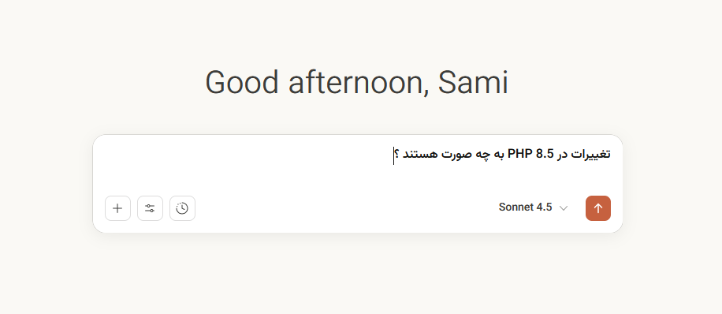
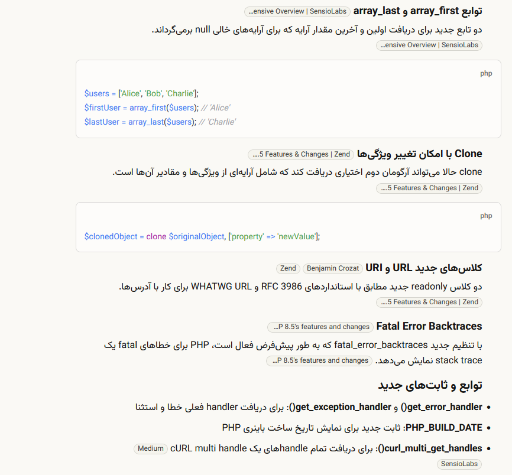
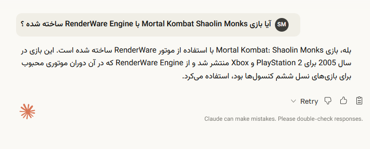

# Claude RTL Plus

یک افزونه برای مرورگر فایرفاکس که تجربه استفاده از کلود را برای کاربران فارسی‌زبان بهبود می‌بخشد.

---

## ویژگی‌ها

- راستچین کردن کامل رابط کاربری کلود
- اضافه کردن فونت فارسی به صفحات کلود
- استفاده از فونت زیبای **وزیرمتن** برای نمایش بهتر متون فارسی

---

## اسکرین‌شات

| | | |
|:---:|:---:|:---:|
|  |  |  |

---

## نصب

### فایرفاکس

افزونه را از صفحه رسمی افزونه‌های فایرفاکس نصب کنید:

### کروم

نسخه کروم این افزونه وجود دارد اما فعلاً منتشر نشده است.

---

## فونت وزیرمتن

این افزونه از فونت [وزیرمتن](https://github.com/rastikerdar/vazirmatn) ساخته **رستی کردار** استفاده می‌کند که یکی از بهترین فونت‌های فارسی متن‌باز است.

---

## مجوز

این پروژه تحت مجوز [MIT](LICENSE) منتشر شده است.
